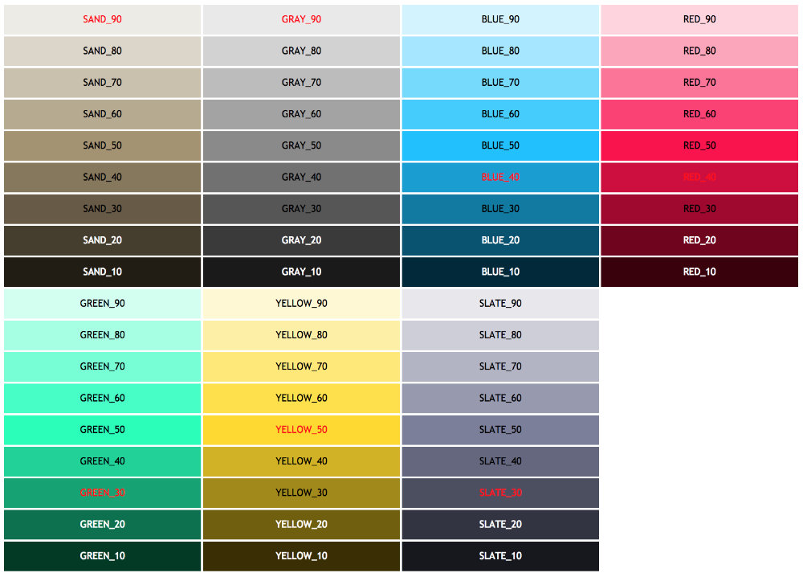

# binary-ui-styles

## Description

This package provides a set of React components implementing Binary Design System. Read more about components: [Color System](https://medium.com/binary-design/color-system-f8c7dfae7ab5) and [Typography](https://medium.com/binary-design/typography-dd26f30ad590).

### Layout styles (web)

const                  | use
-----------------------|-------------
NO_SELECT_CSS          | same as above but CSS
LIST_ITEM_HEIGHT       | default height of list elements in non-card stacks

### Layout styles (native)

const                     | use
--------------------------|-------------
MAIN_FONT_FAMILY_IOS      | set default font for iOS
MAIN_FONT_FAMILY_ANDROID  | set default font for Android

### Color styles (web and native)

Cards color palette relies on six elementary color percepts of human vision—the psychological primaries—as described by Natural Color System, plus additional brand colors. The number following color name signifies luminocity. Red color signifies recommended hue.

## License

MIT
